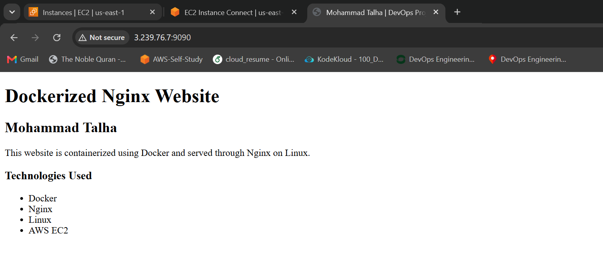
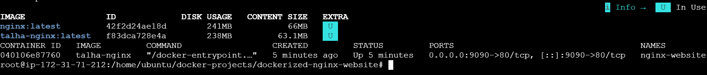
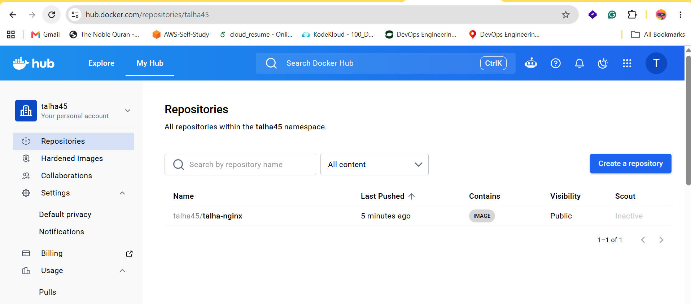

# Dockerized Nginx Website

## Overview

This project demonstrates containerization of a static website using Docker and Nginx.

The application was built on Linux, packaged into a Docker image, and deployed inside a Docker container.

## Technologies Used

- Docker
- Nginx
- Linux
- AWS EC2

## Project Architecture

User Browser
     |
     v
AWS EC2 Instance
     |
     v
Docker Container
     |
     v
Nginx Web Server
     |
     v
Static Website

## Build Docker Image

```bash
docker build -t talha-nginx .
```

## Run Container

```bash
docker run -d --name nginx-website -p 9090:80 talha-nginx
```

## Verify Deployment

```bash
docker ps
```

## Docker Hub Repository

https://hub.docker.com/repositories/talha45

## Screenshots

### Website Deployment



### Docker Images



### Docker Hub Repository




## Author

Mohammad Talha
